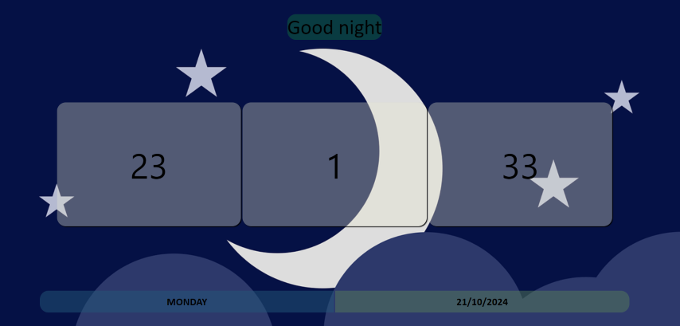

# DIGITAL CLOCK 🌟

A dynamic digital clock built using HTML, CSS, and JavaScript, with several interactive features that change based on the current time. This project offers not only a functional clock but also a personalized user experience by dynamically updating greetings, dates, and wallpapers.

---

## Features 🚀

- **Real-time Clock**: Displays the current time in HH:MM:SS format, updating every second.

- **Dynamic Day and Date**: Automatically updates the day (e.g., Monday) and the full date.

- **Personalized Greetings**:
     - Good Morning (early hours).
       
     - Good Afternoon (mid-day).
       
     - Good Evening (evening).
       
     - Good Night (late hours).
 
- **Dynamic Wallpaper Change**:
 
    - 🌅 Morning: Sunrise-themed wallpaper.
 
    - 🌞 Afternoon and Evening: Bright or scenic wallpapers.
 
    - 🌙 Night: Sunset or night-themed wallpaper.
 
 ---

 ## Demo:
 Open the project click [here](https://naveenkumar-developer.github.io/digitalclock.github.io/)

---

##  How it Works 🧪

- **Clock**: The JavaScript function updates the time every second using the setInterval() function.

- **Date and Day**: The day and date update dynamically based on the system’s date.

- **Greetings**: Changes according to the current time.

- **Wallpapers**: JavaScript logic swaps wallpapers according to the time of day, enhancing the user’s experience.

---

## Learning Outcomes 📝

- Working with Date() object and managing time-based events.

- Dynamically updating the DOM with JavaScript.

- Using CSS animations and styles to enhance the look and feel.

- Managing event loops and intervals in JavaScript.

---

## Contributing 🤝

Feel free to open issues or submit pull requests with new features or improvements!

